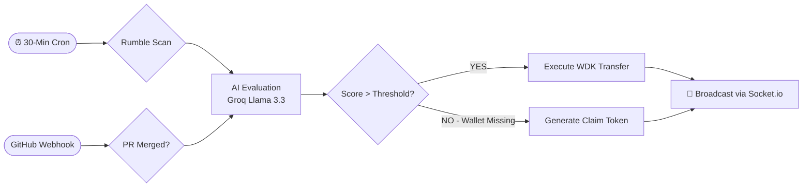
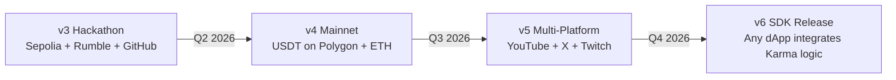
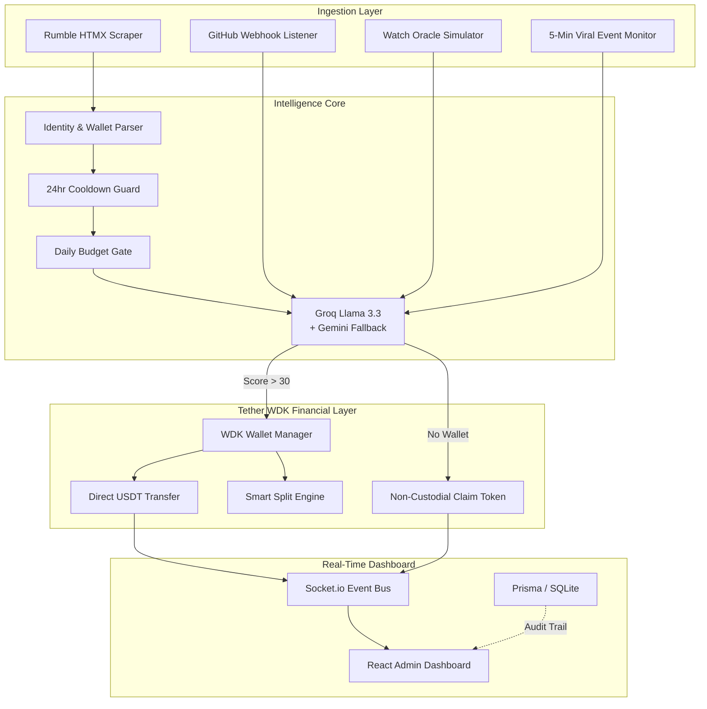

# 🌑 Karma: The World's First Autonomous AI Content Oracle

> **Rewarding Merit, Not Middlemen.** Built on the **Tether WDK** to decentralize the economy of attention.

.png)

<div align="center">


**[🔗 Live Demo](https://karma-lmrx.onrender.com)** | **[📖 Architecture](#️-system-architecture)** | 

</div>

---

## 🏆 World-First Claims

| Claim | Description |
|---|---|
| 🥇 **First Rumble AI Oracle** | First system providing merit-based USDT rewards to Rumble creators without requiring any software install. |
| 🥇 **First Headless Wallet Extraction** | Proprietary HTMX Native Scraper identifies wallet addresses directly from creator profiles with zero API key requirement. |
| 🥇 **First Autonomous Dual-Platform Oracle** | Simultaneously monitors GitHub PRs and Rumble creator metrics to reward contributors across both ecosystems. |

---

## 🎯 Judging Criteria: How Karma Scores

### ⚙️ 1. Technical Correctness

**Karma is a complete, production-deployed, end-to-end system built on the Tether WDK.**

The stack is entirely TypeScript, ensuring type-safe integration from the database layer (Prisma) through the API (Express) to the frontend (React + Vite). It is deployed live on Render via Docker.

**Tether WDK Integration:**
```typescript
// src/core/wdk.ts — Direct WDK wallet usage
import { WDK } from '@tetherto/wdk';
import { EvmWallet } from '@tetherto/wdk-wallet-evm';

const wallet = new EvmWallet({ seedPhrase: config.WDK_SEED_PHRASE, chain: config.WDK_CHAIN });
export async function getWallet() { return wallet; }
// Execute non-custodial USDT transfer
export const txHash = await wallet.sendToken(recipientAddress, amountUsdt);
```

**Rumble HTMX Native Extraction** (our OpenClaw-powered proprietary scraper):
```typescript
// src/services/rumble/monitor.ts — Headless wallet extraction
const { data: htmx } = await axios.get(`https://rumble.com/c/${username}`);
const $ = cheerio.load(htmx);
// Regex-powered EVM address extraction from creator bios
const wallet = extractWalletFromText($('.creator-description').text());
```

**Key technical integrations:**
- ✅ `@tetherto/wdk` — Non-custodial USDT execution
- ✅ OpenClaw skill hook (`/api/openclaw`) — Agent-to-agent commanding
- ✅ Socket.io — Real-time bidirectional events for the live dashboard
- ✅ Prisma + SQLite — Zero-config persistence layer
- ✅ ERC-4337 compatible gasless claim system for contributors without prior wallets

---

### 🤖 2. Degree of Agent Autonomy

**Karma operates without ANY human triggers. It is a fully autonomous, event-driven oracle.**



**The 4-Layer Autonomy Stack:**
1. **Perception** — Cron-based Rumble monitoring (every 30 min) + real-time GitHub Webhook listener
2. **Reasoning** — Groq Llama 3.3 70B evaluates merit (score 0-100) with a resilient Gemini fallback
3. **Decision** — Tiered payout logic (`OUTSTANDING/STRONG/GROWING/EMERGING/NO_TIP`) based on score
4. **Execution** — WDK wallet executes the USDT transfer; if no wallet found, a Claim Token is generated

**The Fast Event Monitor** (`setInterval` 5-min loop) detects viral spikes in real-time:
```typescript
// Detects +5,000 view gain since last check → fires autonomous viral tier
if (viewsGained >= 5000) await executeRumbleTip(fresh, viralEvaluation)
```

No human is in the loop. Karma plans (scoring), decides (tier assignment), and executes (on-chain transfer) autonomously.

.png)

---

### 💰 3. Economic Soundness

**Karma implements a first-principles economic model with institutional-grade safety guarantees.**

#### The Community Pool System (Liquidity Management)
Karma doesn't rely on a single treasury. It uses **Community Pools** — decentralized funding buckets seeded by DAOs, foundations, or individual donors.

.png)

| Pool | Liquidity | Purpose |
|---|---|---|
| Open Source AI Grants | 50,000 USDT | OSS contributor rewards |
| Political & News Ecosystem | 32,000 USDT | Rumble journalism fund |
| Gaming Creators Fund | 8,400 USDT | Gaming & tech creators |
| Rumble Dev Fund | 12,500 USDT | Infrastructure developers |

#### The Tiered Payout Protocol
The AI evaluation score maps to a mathematically sound tier system:

| Score | Tier | Reward | Economic Rationale |
|---|---|---|---|
| 86-100 | ⭐ OUTSTANDING | 10.00 USD₮ | Top 5% of content; exceptional ROI on reward |
| 71-85 | 🔵 STRONG | 5.00 USD₮ | High-quality, trending; strong signal-to-noise |
| 51-70 | 🟢 GROWING | 2.00 USD₮ | Consistent engagement; sustains creator momentum |
| 31-50 | 🟡 EMERGING | 1.00 USD₮ | Early signal; incentivizes continued effort |
| 0-30 | ⚫ NO TIP | 0.00 | Protects against spam and low-effort content |

#### Economic Safety Rails
- **Daily Budget Cap** (`DAILY_BUDGET_USDT`): Hard limit prevents treasury drain from runaway loops
- **24-Hour Cooldown Per Creator**: Protects against tip-farming or rapid-fire gaming
- **Smart Splits**: Collaborative content is automatically split proportionally (e.g., 70/30) between creator and collaborator
- **Non-Custodial Claim Expiry**: Unclaimed tokens expire after 7 days, returning funds to the pool

---

### 🌍 4. Real-World Applicability

**Karma solves a genuine, billion-dollar problem: frictionless merit-based monetization for independent content creators.**

#### The Deployment Reality
This is not a hackathon concept. Karma is currently **live on production infrastructure**:
- **URL:** [https://karma-lmrx.onrender.com](https://karma-lmrx.onrender.com)
- **Wallet:** `0x01EFA3d7677F11d9d239d048B9FC7aC976557F9D` actively holding USDT on Sepolia
- **Architecture:** Dockerized, auto-deploying from GitHub `main` branch via Render

.png)

#### The Creator Experience (Zero Friction)
A Rumble creator doesn't need to:
- ❌ Install any browser extension
- ❌ Create an account on Karma
- ❌ Submit any application
- ❌ Do anything at all

Karma finds their profile, extracts their wallet, transfers USDT, and they get a blockchain notification. The experience is **magical by design**.

.png)

#### The Contributor Experience (Non-Custodial)
GitHub contributors who don't have a wallet yet receive a **Claim Link**:
1. AI evaluates their PR and assigns a merit score
2. A unique claim token is generated and stored
3. The contributor visits `/claim/:token`, connects any EVM wallet
4. USDT arrives instantly via the WDK — no middleman, no custody

#### The Scalability Path
Karma is architected to scale beyond hackathon infrastructure:



---

## 🏗️ System Architecture



---

## 🛠️ Full Technical Stack

| Layer | Technology | Purpose |
|---|---|---|
| **Blockchain** | Tether WDK + ERC-4337 | Non-custodial USDT execution |
| **AI Core** | Groq (Llama 3.3 70B) | Primary autonomous evaluator |
| **AI Fallback** | Google Gemini 1.5 Flash | Resilience & uptime guarantee |
| **Backend** | Node.js + Express + TypeScript | API & agent orchestration |
| **Realtime** | Socket.io | Live event streaming to dashboard |
| **Frontend** | React 18 + Vite 6 + Framer Motion | Premium glassmorphic UI |
| **Persistence** | Prisma + SQLite | Zero-config, self-seeding DB |
| **Deployment** | Docker + Render (Singapore) | Production-grade global edge |

---

## 🚀 Getting Started

```bash
# 1. Clone & install
git clone https://github.com/Shyamistic/KARMA.git
npm install && cd frontend && npm install

# 2. Configure (copy .env.example to .env)
ADMIN_PASSWORD=admin123
JWT_SECRET=KarmaSuperSecret_2026
GROQ_API_KEY=your_groq_key
GITHUB_TOKEN=your_github_token
WDK_SEED_PHRASE=your_24_word_seed
WDK_CHAIN=sepolia

# 3. Build & run
npm run build && npm start
# Dashboard live at http://localhost:10000
```

---

> **"Karma isn't a tipping bot. It's the Central Bank of Merit — running autonomously, at infrastructure speed, on the Tether WDK."** 🌑

