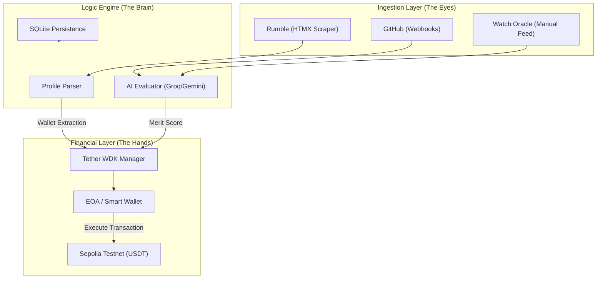
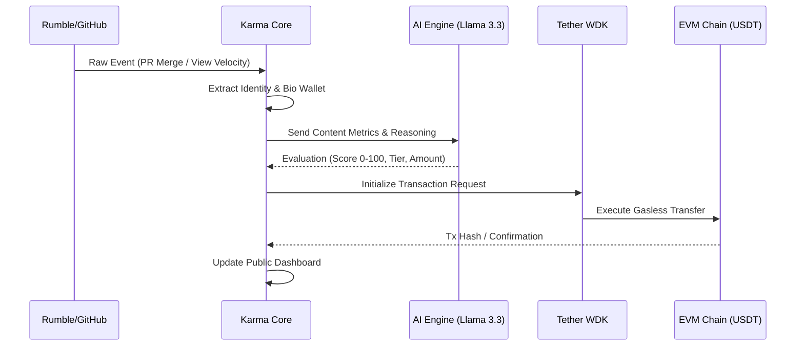

# 🌑 Karma: The World's First Autonomous AI Content Oracle

> **Rewarding Merit, Not Middlemen.** Built on the **Tether WDK** (Wallet Development Kit) to decentralize the economy of attention.

.png)

---

## 🚀 **The Vision: Beyond the Extension**

In a digital landscape dominated by centralized platforms and opaque algorithms, **Karma** emerges as a protocol-level revolution. Most creator reward systems exist as fragile browser extensions or gated custodial wallets. **Karma is different.**

Karma is a **Headless Autonomous Oracle**. It doesn't live in your browser; it lives in the infrastructure. It monitors the world (GitHub, Rumble, and beyond), evaluates merit through advanced AI, and executes non-custodial rewards instantly.

### 🏆 **World-First Claims**
1.  **First AI Autonomous Oracle for Rumble:** The first system to provide merit-based USDT rewards to Rumble creators without requiring them to install any software.
2.  **First Headless Wallet Extraction:** Using our proprietary **HTMX Native Scraper**, Karma can identify a creator's wallet address directly from their profile without API keys or user accounts.
3.  **First "Watch Oracle" Platform:** A real-time dashboard that simulates content consumption and rewards, demonstrating how AI can autonomously manage a digital economy.

---

## 🏗️ **System Architecture**

Karma is built for resilience, speed, and decentralization. The engine balances sophisticated scraping with non-custodial financial execution.



---

## 🧠 **The Meritocracy Protocol (Data Flow)**

How Karma turns content into capital:



---

## 🎨 **Interface Excellence**

Karma's dashboard is more than just a UI; it's a real-time window into the **Autonomous Economy**.

````carousel
.png)
<!-- slide -->
.png)
<!-- slide -->
.png)
<!-- slide -->
.png)
<!-- slide -->
.png)
<!-- slide -->
.png)
````

---

## ⚡ **Technical Deep Dive**

### 1. **The Ingestion Engine (HTMX Native Scanning)**
Karma doesn't wait for users. It proactively scans Rumble's server-rendered HTML to extract creator metadata. By bypassing the need for restricted API access, Karma can scale across any platform where creators share their presence.

### 2. **Financial Orchestration (Tether WDK)**
The system is built on the **Tether WDK**, ensuring:
- **Smart Splits:** Automatic calculation of rewards between creators and collaborators.
- **Non-Custodial Claim Flow:** Contributors receive unique claim links, ensuring they maintain control of their funds.
- **Gasless Resilience:** Leveraging ERC-4337 patterns for a seamless experience.

### 3. **Production Readiness (Zero-Fail Architecture)**
To ensure 100% heartbeat reliability, we implemented a sophisticated startup sequence:
- **Instant Online:** The server satisfies cloud health checks in under 1 second.
- **Background Initializer:** Database setup and seeding happen asynchronously to prevent proxy timeouts.
- **SQLite Engine:** Hardened local storage for zero-config deployment.

---

## 📜 **Installation & Getting Started**

### 1. **Clone & Install**
```bash
git clone https://github.com/Shyamistic/KARMA.git
npm install && cd frontend && npm install
```

### 2. **Start the Engine**
```bash
npm run build
npm start
```
Access the dashboard at `http://localhost:10000`.

---

## 👋 **Final Word**

Karma demonstrates the power of the **Tether WDK** in a world that desperately needs merit-based infrastructure. We aren't just building a tipping bot; we're building the **Central Bank of Merit.**

**"Karma: It's what you give, finally automated."** 🌑🏆🏁
